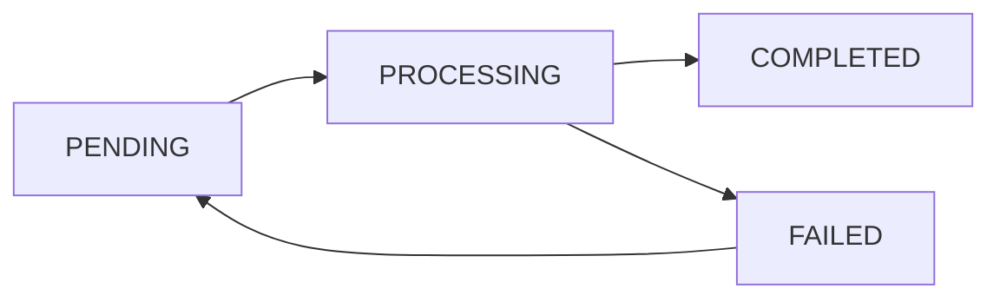

## Overview

AssetCalculationJob endpoints manage background processing of measurement observations. Each job applies protocol-specific formulas to generate AssetResultSnapshot records with metrics, quality indicators, and decision support outputs.

## Calculation Job Status

<ResponseField name="status" type="enum">
  - `PENDING` - Job queued for processing
  - `PROCESSING` - Job currently executing
  - `COMPLETED` - Job finished successfully
  - `FAILED` - Job failed with error
</ResponseField>

## State Transitions



<Note>
  Failed jobs can be retried by creating a new job for the same campaign.
</Note>

## GET /api/assets/calculation-jobs

List calculation jobs with filtering and pagination.

### Query Parameters

<ParamField query="campaignId" type="string" format="uuid">
  Filter by campaign ID
</ParamField>

<ParamField query="domain" type="enum">
  Filter by asset domain
</ParamField>

<ParamField query="protocolType" type="enum">
  Filter by protocol type
</ParamField>

<ParamField query="status" type="enum">
  Filter by job status
</ParamField>

<ParamField query="page" type="integer" default="1">
  Page number
</ParamField>

<ParamField query="limit" type="integer" default="25">
  Items per page
</ParamField>

<ParamField query="sortBy" type="enum" default="createdAt">
  Sort field: createdAt, completedAt, status
</ParamField>

<ParamField query="sortOrder" type="enum" default="desc">
  Sort order: asc, desc
</ParamField>

### Response

<ResponseField name="items" type="array">
  <Expandable title="Calculation job object">
    <ResponseField name="id" type="string" format="uuid">
      Job ID
    </ResponseField>
    <ResponseField name="organizationId" type="string" format="uuid">
      Organization ID
    </ResponseField>
    <ResponseField name="campaignId" type="string" format="uuid">
      Campaign ID
    </ResponseField>
    <ResponseField name="domain" type="enum">
      Asset domain
    </ResponseField>
    <ResponseField name="protocolType" type="enum">
      Measurement protocol type
    </ResponseField>
    <ResponseField name="status" type="enum">
      Job status
    </ResponseField>
    <ResponseField name="attempts" type="integer">
      Number of execution attempts
    </ResponseField>
    <ResponseField name="runAfter" type="string" format="datetime">
      Scheduled execution time
    </ResponseField>
    <ResponseField name="startedAt" type="string" format="datetime" nullable>
      Job start time
    </ResponseField>
    <ResponseField name="completedAt" type="string" format="datetime" nullable>
      Job completion time
    </ResponseField>
    <ResponseField name="errorMessage" type="string" nullable>
      Error details if failed
    </ResponseField>
    <ResponseField name="payload" type="object" nullable>
      Job configuration (JSON)
    </ResponseField>
    <ResponseField name="campaign" type="object">
      Campaign summary
    </ResponseField>
    <ResponseField name="createdAt" type="string" format="datetime">
      Creation timestamp
    </ResponseField>
  </Expandable>
</ResponseField>

<ResponseField name="pagination" type="object">
  Pagination metadata
</ResponseField>

<RequestExample>
```bash cURL
curl -X GET "https://api.smyeg.com/api/assets/calculation-jobs?status=PENDING&page=1" \
  -H "Authorization: Bearer YOUR_TOKEN"
```
</RequestExample>

## POST /api/assets/calculation-jobs

Enqueue a new calculation job.

### Request Body

<ParamField body="campaignId" type="string" format="uuid" required>
  Campaign ID to process
</ParamField>

<ParamField body="runAfter" type="string" format="datetime">
  Schedule job for future execution (defaults to now)
</ParamField>

<ParamField body="payload" type="object">
  Optional job configuration (JSON)
</ParamField>

### Response

Returns the created job object with status 201.

<RequestExample>
```bash cURL
curl -X POST "https://api.smyeg.com/api/assets/calculation-jobs" \
  -H "Authorization: Bearer YOUR_TOKEN" \
  -H "Content-Type: application/json" \
  -d '{
    "campaignId": "abc123-def456",
    "runAfter": "2026-03-15T22:00:00Z"
  }'
```

```javascript JavaScript
const job = await fetch('/api/assets/calculation-jobs', {
  method: 'POST',
  headers: {
    'Authorization': 'Bearer YOUR_TOKEN',
    'Content-Type': 'application/json'
  },
  body: JSON.stringify({
    campaignId: 'abc123-def456'
  })
});
```
</RequestExample>

## DELETE /api/assets/calculation-jobs

Delete a calculation job. Jobs with status PROCESSING cannot be deleted.

### Request Body

<ParamField body="id" type="string" format="uuid" required>
  Job ID
</ParamField>

### Response

Returns the deleted job ID.

### Error Responses

- **404** - Job not found
- **409** - Job is currently processing and cannot be deleted

<RequestExample>
```bash cURL
curl -X DELETE "https://api.smyeg.com/api/assets/calculation-jobs" \
  -H "Authorization: Bearer YOUR_TOKEN" \
  -H "Content-Type: application/json" \
  -d '{"id": "job-123"}'
```
</RequestExample>

## Worker Endpoint

### POST /api/assets/calculation-jobs/worker

Execute calculation jobs. This endpoint is called by background workers or cron jobs.

**Authentication:**
- Header `x-worker-secret` with value from `ASSET_MEASUREMENT_WORKER_SECRET` env var, OR
- Bearer token with `asset-measurement:UPDATE` permission

### Request Body

<ParamField body="jobId" type="string" format="uuid">
  Process specific job ID (if omitted, processes next pending job)
</ParamField>

### Response

<ResponseField name="processed" type="boolean">
  Whether a job was processed
</ResponseField>

<ResponseField name="status" type="enum">
  Final job status (COMPLETED or FAILED)
</ResponseField>

<ResponseField name="reason" type="string">
  Reason if not processed (e.g., "no_pending_jobs", "job_not_found")
</ResponseField>

<ResponseField name="campaignId" type="string" format="uuid">
  Campaign ID (if processed)
</ResponseField>

<ResponseField name="resultKey" type="string">
  Result snapshot key
</ResponseField>

<ResponseField name="resultVersion" type="integer">
  Result snapshot version
</ResponseField>

<ResponseField name="observationCount" type="integer">
  Number of observations processed
</ResponseField>

<ResponseField name="error" type="string">
  Error message if failed
</ResponseField>

<RequestExample>
```bash cURL
curl -X POST "https://api.smyeg.com/api/assets/calculation-jobs/worker" \
  -H "x-worker-secret: YOUR_WORKER_SECRET" \
  -H "Content-Type: application/json" \
  -d '{"jobId": "job-123"}'
```

```bash Process Next Pending
curl -X POST "https://api.smyeg.com/api/assets/calculation-jobs/worker" \
  -H "x-worker-secret: YOUR_WORKER_SECRET" \
  -H "Content-Type: application/json" \
  -d '{}'
```
</RequestExample>

## Protocol Formulas

The calculation worker applies specialized formulas based on protocol type:

### BIO_SOBREVIVENCIA

**Metrics Calculated:**
- `SURVIVAL_REAL_PCT` - (Live / (Live + Dead + Missing)) × 100
- `SURVIVAL_PRESC_PCT` - (Live / Expected from spacing) × 100
- `DENSITY_VIVA_HA` - Live plants per hectare
- `AVG_HEIGHT_RODAL` - Mean height across parcels
- `SAMPLING_ERROR_PCT` - t-Student 95% confidence interval
- `SURVIVAL_SEMAFORO` - VERDE (&gt;90%), AMARILLO (75-90%), ROJO (&lt;75%), GRIS (no data)
- `SURVIVAL_ACCEPTANCE_STATUS` - ACEPTADO, REQUIERE_REPLANTE, SIN_DATOS
- `BIOLOGICAL_ACCOUNTING_STATUS` - Accounting status based on survival
- `NEXT_INVENTORY_PROTOCOL` - Recommended next protocol
- `OPERATIONAL_ACTION` - Decision support action

**Quality Indicators:**
- Valid vs invalid observation counts
- Missing height data percentage
- Replant action classification

**Validation Rules:**
- Live + Dead + Missing must match theoretical density
- Tolerance: ±1 plant per 100m² sample

### BIO_PREOPERATIVO

**Metrics:**
- `ESTABLISHMENT_COMPLIANCE_PCT` - (Established / Target) × 100
- `FAILURE_RATE_PCT` - (Failed / Established) × 100
- `NET_DENSITY_HA` - Net density per hectare
- `READINESS_CLASS` - LISTO (≥95%), AJUSTE_MENOR (85-95%), REPROGRAMAR (&lt;85%)

### BIO_PRECOSECHA

**Metrics:**
- `HARVEST_READINESS_PCT` - (Marked / Harvestable) × 100
- `ESTIMATED_VOLUME_M3_HA` - Volume per hectare
- `QUALITY_ACCEPTABLE_PCT` - Quality acceptance rate
- `HARVEST_CLASS` - LISTA_COSECHA (≥90%), AJUSTE_PLAN (75-90%), NO_APTA (&lt;75%)

### BIO_CONTINUO

**Metrics:**
- `LIVE_STOCK_DENSITY_HA` - Current live stock density
- `MEAN_INCREMENT_M3_HA` - Volume increment
- `MORTALITY_RATE_PCT` - Mortality since previous measurement
- `HEALTH_ALERT_RATE_PCT` - Health incident rate
- `CONTINUITY_STATUS` - ESTABLE, ALERTA_SANITARIA, RIESGO_MORTALIDAD

### BIO_PARCELAS_PERMANENTES

**Metrics:**
- `TREE_DENSITY_HA` - Trees per hectare
- `BASAL_AREA_HA` - Basal area per hectare (m²)
- `MEAN_DBH_CM` - Mean diameter at breast height
- `STAND_STATUS` - OPTIMO, EN_DESARROLLO, DEGRADADO

### HIDRO_ESTACION_HIDROLOGICA

**Metrics:**
- `MEAN_FLOW_M3S` - Mean flow (m³/s)
- `MAX_FLOW_M3S` - Maximum flow
- `MEAN_WATER_LEVEL_M` - Mean water level (m)
- `FLOW_VARIABILITY_PCT` - Coefficient of variation
- `HYDRO_ALERT_DAYS` - Days exceeding thresholds
- `HYDRO_STATUS` - BAJO_RIESGO, RIESGO_MEDIO, RIESGO_ALTO, DATOS_INSUFICIENTES

**Quality:**
- Day coverage percentage
- Sensor status filtering (OK, WARNING accepted; ERROR, OFFLINE ignored)

### HIDRO_ESTACION_METEOROLOGICA

**Metrics:**
- `TOTAL_PRECIP_MM` - Total precipitation (mm)
- `MEAN_AIR_TEMP_C` - Mean air temperature (°C)
- `MEAN_REL_HUMIDITY_PCT` - Mean relative humidity (%)
- `MAX_WIND_SPEED_MPS` - Max wind speed (m/s)
- `METEO_ALERT_DAYS` - Alert days count
- `METEO_STATUS` - ESTABLE, ALERTA_MEDIA, ALERTA_ALTA, DATOS_INSUFICIENTES

### DENDRO_PARCELA_MULTIPROPOSITO

**Metrics:**
- `VOLUME_M3_HA` - Merchantable volume per hectare
- `INCREMENT_M3_HA` - Current increment
- `TREE_DENSITY_HA` - Tree density
- `PRODUCTIVITY_CLASS` - ALTA (≥10), MEDIA (6-10), BAJA (&lt;6)

### DENDRO_PARCELA_CARBONO

**Metrics:**
- `BIOMASS_T_HA` - Total biomass per hectare (tons)
- `CARBON_STOCK_T_HA` - Carbon stock (biomass × 0.47)
- `CO2_EQ_T_HA` - CO₂ equivalent (carbon × 44/12)
- `CARBON_CLASS` - ALTA_CAPTURA (≥90), CAPTURA_MEDIA (55-90), CAPTURA_BAJA (&lt;55)

### DEMO_ENCUESTA_COMUNIDAD

**Metrics:**
- `COMMUNITY_POPULATION_TOTAL` - Total population
- `MEAN_HOUSEHOLD_SIZE` - Mean household size
- `EMPLOYMENT_RATE_PCT` - Employment rate
- `BASIC_SERVICES_COVERAGE_PCT` - Basic services coverage
- `COMMUNITY_STATUS` - ESTABLE, EN_TRANSICION, VULNERABLE

### DEMO_ENCUESTA_NUCLEO_FAMILIAR

**Metrics:**
- `HOUSEHOLD_MEAN_MEMBERS` - Mean household members
- `HOUSEHOLD_MEAN_INCOME_USD` - Mean monthly income
- `FOOD_SECURITY_RATE_PCT` - Food security rate
- `SCHOOL_ATTENDANCE_RATE_PCT` - School attendance rate
- `HOUSEHOLD_STATUS` - RESILIENTE, INTERMEDIO, PRIORITARIO

## Result Snapshots

Calculation jobs create `AssetResultSnapshot` records:

```json
{
  "campaignId": "abc123",
  "level4Id": "level4-id",
  "domain": "BIOLOGICO",
  "resultKey": "BIO-2026-001_AUTO_SUMMARY",
  "resultVersion": 1,
  "schemaVersion": "1.0",
  "isCurrent": true,
  "resultPayload": {
    "summary": {
      "observationCount": 50,
      "sectionCount": 5,
      "level5UnitCount": 10,
      "observationsBySection": {...},
      "observationsByLevel5Unit": {...}
    },
    "metrics": {
      "SURVIVAL_REAL_PCT": 87.5,
      "SURVIVAL_PRESC_PCT": 85.2,
      "DENSITY_VIVA_HA": 1050,
      "AVG_HEIGHT_RODAL": 2.4,
      "SAMPLING_ERROR_PCT": 5.2,
      "SURVIVAL_SEMAFORO": "AMARILLO",
      "SURVIVAL_ACCEPTANCE_STATUS": "REQUIERE_REPLANTE",
      "BIOLOGICAL_ACCOUNTING_STATUS": "NO_ACTIVABLE_POR_SOBREVIVENCIA",
      "NEXT_INVENTORY_PROTOCOL": "REEVALUAR_POST_REPLANTE",
      "OPERATIONAL_ACTION": "EJECUTAR_REPOSICIONES_DE_REPLANTE"
    },
    "quality": {
      "validObservationCount": 48,
      "invalidObservationCount": 2,
      "totalObservationCount": 50,
      "zeroLiveObservationCount": 0,
      "missingHeightCount": 3,
      "missingHeightPct": 6.25,
      "avgHeightIsReferential": true,
      "replantAction": "REPLANTE_PARCIAL"
    },
    "protocolType": "BIO_SOBREVIVENCIA",
    "generatedBy": "asset-measurement-worker",
    "formulaVersion": "1.0.0"
  },
  "calculatedAt": "2026-03-15T15:30:00Z"
}
```

<Note>
  Each campaign execution creates a new version. The `isCurrent` flag marks the latest result.
</Note>

## Permissions

- **READ** - View calculation jobs (permission: `asset-measurement:READ`)
- **CREATE** - Enqueue jobs (permission: `asset-measurement:CREATE`)
- **UPDATE** - Execute worker endpoint (permission: `asset-measurement:UPDATE`)
- **DELETE** - Delete jobs (permission: `asset-measurement:DELETE`)
- **Worker Secret** - Bypass auth with `ASSET_MEASUREMENT_WORKER_SECRET` header

## Scheduling

Recommended cron schedule for worker execution:

```bash
# Every 5 minutes
*/5 * * * * curl -X POST https://api.smyeg.com/api/assets/calculation-jobs/worker \
  -H "x-worker-secret: $WORKER_SECRET" \
  -H "Content-Type: application/json" \
  -d '{}'
```

## Related Endpoints

- [Asset Measurement Campaigns](/api/assets/campaigns) - Manage campaigns
- [Asset Measurement Observations](/api/assets/observations) - Field data
