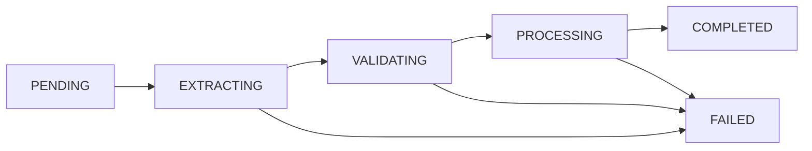

## Overview

GeoImportJob endpoints process zipped shapefiles containing forest patrimony Level 4 geometry. Each import:
- Validates shapefile structure (.shp, .shx, .dbf, .prj)
- Extracts Polygon/MultiPolygon features
- Matches features to existing Level 2/3/4 hierarchy
- Deactivates previous geometry versions
- Inserts new geometry with calculated surface area and centroid
- Updates Level 4 surface area and land use
- Creates LandPatrimonialVariation records for land use changes
- Recalculates LandUseType surface totals

## Import Job Status Enum

<ResponseField name="status" type="enum">
  - `PENDING` - Job queued
  - `EXTRACTING` - Unzipping and validating shapefile
  - `VALIDATING` - Checking required files and structure
  - `PROCESSING` - Processing features
  - `COMPLETED` - Import finished
  - `FAILED` - Import failed with error
</ResponseField>

## State Transitions



## Import Item Status

<ResponseField name="status" type="enum">
  - `PROCESSED` - Feature successfully imported
  - `FAILED` - Feature failed validation or processing
</ResponseField>

## GET /api/forest/geo/import

Download shapefile import template.

### Query Parameters

<ParamField query="format" type="enum" default="csv">
  Template format: csv (attribute reference), xlsx
</ParamField>

### Response

Returns CSV/Excel template with attribute mapping reference.

**Template Attributes:**
- `nivel2` / `nivel_2` / `cod_n2` / `finca` - Level 2 code
- `nivel3` / `nivel_3` / `cod_n3` / `lote` - Level 3 code
- `nivel4` / `nivel_4` / `cod_n4` / `rodal` - Level 4 code
- `usoactual` / `currentlandusename` / `uso` - Current land use name
- `usoanterior` / `previouslandusename` - Previous land use name
- `fechavariacion` / `variationdate` / `landusechangedate` - Variation date
- `observaciones` / `variationnotes` / `notas` - Variation notes

<Note>
  Attribute name matching is case-insensitive and ignores spaces/underscores.
</Note>

<RequestExample>
```bash cURL
curl -X GET "https://api.smyeg.com/api/forest/geo/import?format=csv" \
  -H "Authorization: Bearer YOUR_TOKEN" \
  -o template.csv
```
</RequestExample>

## POST /api/forest/geo/import

Upload shapefile for import processing.

### Request (multipart/form-data)

<ParamField body="file" type="file" required>
  Zipped shapefile (.zip) containing .shp, .shx, .dbf, .prj files
</ParamField>

<ParamField body="variationDate" type="string" format="date">
  Default variation date for land use changes (YYYY-MM-DD)
</ParamField>

<ParamField body="variationNotes" type="string">
  Default notes for variation records
</ParamField>

### Shapefile Requirements

**Required Files in ZIP:**
- `.shp` - Geometry data
- `.shx` - Shape index
- `.dbf` - Attribute table
- `.prj` - Projection definition

**Supported Geometry Types:**
- `Polygon` - Converted to MultiPolygon
- `MultiPolygon` - Used directly

**Coordinate System:**
- Features are reprojected to EPSG:4326 (WGS84)

### Processing Logic

For each feature:

1. **Extract Codes:** Parse nivel2, nivel3, nivel4 from attributes
2. **Validate Hierarchy:** Verify Level 2→3→4 exists in organization
3. **Validate Land Use:** Check currentLandUseName exists in LandUseType catalog
4. **Deactivate Old Geometry:** Set `is_active=FALSE`, `valid_to=NOW()` for existing Level 4 geometry
5. **Insert New Geometry:** Create new geometry record with `is_active=TRUE`, `valid_from=NOW()`
6. **Calculate Metrics:** Use PostGIS to compute `superficie_ha` and `centroid`
7. **Update Level 4:** Set `totalAreaHa`, `centroidLatitude`, `centroidLongitude`, `currentLandUseName`
8. **Create Variation:** If land use changed, create `LandPatrimonialVariation` record
9. **Sync Land Use Totals:** Recalculate `LandUseType.surfaceHa` for organization

### Response

<ResponseField name="jobId" type="string" format="uuid">
  Import job ID
</ResponseField>

<ResponseField name="status" type="enum">
  Initial status (PENDING)
</ResponseField>

<ResponseField name="message" type="string">
  Success message
</ResponseField>

<RequestExample>
```bash cURL
curl -X POST "https://api.smyeg.com/api/forest/geo/import" \
  -H "Authorization: Bearer YOUR_TOKEN" \
  -F "file=@patrimony_nivel4.zip" \
  -F "variationDate=2026-03-15" \
  -F "variationNotes=Actualización masiva GIS Q1 2026"
```

```javascript JavaScript
const formData = new FormData();
formData.append('file', fileInput.files[0]);
formData.append('variationDate', '2026-03-15');
formData.append('variationNotes', 'Actualización masiva GIS');

const response = await fetch('/api/forest/geo/import', {
  method: 'POST',
  headers: {
    'Authorization': 'Bearer YOUR_TOKEN'
  },
  body: formData
});

const { jobId } = await response.json();
console.log('Job ID:', jobId);
```
</RequestExample>

## GET /api/forest/geo/import/{jobId}

Retrieve import job status and results.

### Path Parameters

<ParamField path="jobId" type="string" format="uuid" required>
  Import job ID
</ParamField>

### Response

<ResponseField name="id" type="string" format="uuid">
  Job ID
</ResponseField>

<ResponseField name="organizationId" type="string" format="uuid">
  Organization ID
</ResponseField>

<ResponseField name="status" type="enum">
  Current job status
</ResponseField>

<ResponseField name="fileName" type="string">
  Original filename
</ResponseField>

<ResponseField name="storagePath" type="string">
  Server storage path
</ResponseField>

<ResponseField name="totalRecords" type="integer">
  Total features in shapefile
</ResponseField>

<ResponseField name="processedRecords" type="integer">
  Successfully processed features
</ResponseField>

<ResponseField name="failedRecords" type="integer">
  Failed features
</ResponseField>

<ResponseField name="metadata" type="object" nullable>
  Job metadata including variationDefaults
</ResponseField>

<ResponseField name="errorMessage" type="string" nullable>
  Error details if failed
</ResponseField>

<ResponseField name="startedAt" type="string" format="datetime" nullable>
  Job start timestamp
</ResponseField>

<ResponseField name="completedAt" type="string" format="datetime" nullable>
  Job completion timestamp
</ResponseField>

<ResponseField name="items" type="array">
  <Expandable title="Import item details">
    <ResponseField name="featureIndex" type="integer">
      Feature index in shapefile (0-based)
    </ResponseField>
    <ResponseField name="status" type="enum">
      PROCESSED or FAILED
    </ResponseField>
    <ResponseField name="level2Code" type="string" nullable>
      Extracted Level 2 code
    </ResponseField>
    <ResponseField name="level3Code" type="string" nullable>
      Extracted Level 3 code
    </ResponseField>
    <ResponseField name="level4Code" type="string" nullable>
      Extracted Level 4 code
    </ResponseField>
    <ResponseField name="message" type="string" nullable>
      Error message if failed
    </ResponseField>
    <ResponseField name="rawProperties" type="object" nullable>
      Original feature properties
    </ResponseField>
  </Expandable>
</ResponseField>

<RequestExample>
```bash cURL
curl -X GET "https://api.smyeg.com/api/forest/geo/import/abc123-def456" \
  -H "Authorization: Bearer YOUR_TOKEN"
```
</RequestExample>

## Worker Endpoint

### POST /api/forest/geo/import/worker

Execute import job processing. Called by background workers.

**Authentication:**
- Header `x-worker-secret` with value from `GEO_WORKER_SECRET` env var, OR
- Bearer token with `forest-patrimony:UPDATE` permission

### Request Body

<ParamField body="mode" type="enum" default="import">
  Worker mode: `import` or `recalc`
</ParamField>

<ParamField body="jobId" type="string" format="uuid">
  Process specific job ID (if omitted, processes next pending job)
</ParamField>

### Response

<ResponseField name="processed" type="boolean">
  Whether a job was processed
</ResponseField>

<ResponseField name="status" type="enum">
  Final job status (COMPLETED or FAILED)
</ResponseField>

<ResponseField name="processedRecords" type="integer">
  Features successfully imported
</ResponseField>

<ResponseField name="failedRecords" type="integer">
  Features that failed
</ResponseField>

<ResponseField name="totalRecords" type="integer">
  Total features in shapefile
</ResponseField>

<ResponseField name="reason" type="string">
  Reason if not processed (e.g., "no_pending_jobs")
</ResponseField>

<ResponseField name="error" type="string">
  Error message if failed
</ResponseField>

<RequestExample>
```bash cURL
curl -X POST "https://api.smyeg.com/api/forest/geo/import/worker" \
  -H "x-worker-secret: YOUR_WORKER_SECRET" \
  -H "Content-Type: application/json" \
  -d '{"mode": "import", "jobId": "abc123"}'
```

```bash Process Next Pending
curl -X POST "https://api.smyeg.com/api/forest/geo/import/worker" \
  -H "x-worker-secret: YOUR_WORKER_SECRET" \
  -H "Content-Type: application/json" \
  -d '{"mode": "import"}'
```
</RequestExample>

## Validation Rules

### Feature-Level Validation

<Warning>
  Features are skipped if:
  - Missing nivel2, nivel3, or nivel4 codes
  - Geometry is not Polygon or MultiPolygon
  - Level 2/3/4 hierarchy does not exist in organization
  - Current land use name not found in LandUseType catalog
  - Previous land use name specified but not in catalog
</Warning>

### Land Use Validation

- Land use names are matched **case-insensitively** against `LandUseType.name`
- Only active (`isActive=TRUE`) land use types are accepted
- If `previousLandUseName` is specified in shapefile, it must also exist in catalog
- If omitted, previous land use is set to current `Level4.currentLandUseName`

### Variation Logic

**Land use variation is created when:**
1. `currentLandUseName` from shapefile differs from existing `Level4.currentLandUseName` (case-insensitive)
2. Variation date: shapefile attribute > form default > current date
3. Variation notes: shapefile attribute > form default > null
4. Variation kind: INCREMENTO if previous differs from new, SIN_CAMBIO otherwise

## Error Handling

### Common Errors

**ZIP validation failed:**
- Missing required files (.shp, .shx, .dbf, .prj)
- Corrupt ZIP archive

**Feature processing errors:**
- Invalid geometry (non-polygon types)
- Hierarchy mismatch (codes don't match existing Level 2/3/4)
- Land use not in catalog
- Surface calculation failed

**Transaction errors:**
- Database constraint violations
- Concurrent geometry updates

<Note>
  All import operations are atomic per feature. If a feature fails, others continue processing.
</Note>

## Permissions

- **READ** - Download templates, view jobs (permission: `forest-patrimony:READ`)
- **CREATE/UPDATE** - Upload shapefiles (permissions: `forest-patrimony:CREATE` or `forest-patrimony:UPDATE`)
- **Worker Secret** - Execute worker with `GEO_WORKER_SECRET` header

## Database Schema

### GeoImportJob

Source: `/home/daytona/workspace/source/prisma/schema.prisma:862-884`

```prisma
model GeoImportJob {
  id               String               @id @default(uuid()) @db.Uuid
  organizationId   String               @map("organization_id") @db.Uuid
  status           GeoImportJobStatus   @default(PENDING)
  fileName         String               @map("file_name") @db.VarChar(255)
  storagePath      String               @map("storage_path")
  totalRecords     Int                  @default(0) @map("total_records")
  processedRecords Int                  @default(0) @map("processed_records")
  failedRecords    Int                  @default(0) @map("failed_records")
  metadata         Json?
  errorMessage     String?              @map("error_message")
  startedAt        DateTime?            @map("started_at")
  completedAt      DateTime?            @map("completed_at")
  createdById      String?              @map("created_by_id") @db.Uuid
  createdAt        DateTime             @default(now()) @map("created_at")
  updatedAt        DateTime             @updatedAt @map("updated_at")
  items            GeoImportJobItem[]
  geometries       ForestGeometryN4[]
}
```

### ForestGeometryN4

Source: `/home/daytona/workspace/source/prisma/schema.prisma:839-860`

```prisma
model ForestGeometryN4 {
  id             String      @id @default(uuid()) @db.Uuid
  organizationId String      @map("organization_id") @db.Uuid
  level2Id       String      @map("level2_id") @db.Uuid
  level3Id       String      @map("level3_id") @db.Uuid
  level4Id       String      @map("level4_id") @db.Uuid
  geom           Unsupported("geometry(MultiPolygon, 4326)")
  centroid       Unsupported("geometry(Point, 4326)")
  superficieHa   Decimal     @default(0) @map("superficie_ha") @db.Decimal(12, 4)
  validFrom      DateTime    @default(now()) @map("valid_from")
  validTo        DateTime?   @map("valid_to")
  isActive       Boolean     @default(true) @map("is_active")
  importJobId    String?     @map("import_job_id") @db.Uuid
  createdAt      DateTime    @default(now())
  updatedAt      DateTime    @updatedAt
}
```

## Related Endpoints

- [GeoRecalcJob](/api/geo/recalculation) - Recalculate surface for existing geometry
- Land Patrimonial Variations - View land use change history
