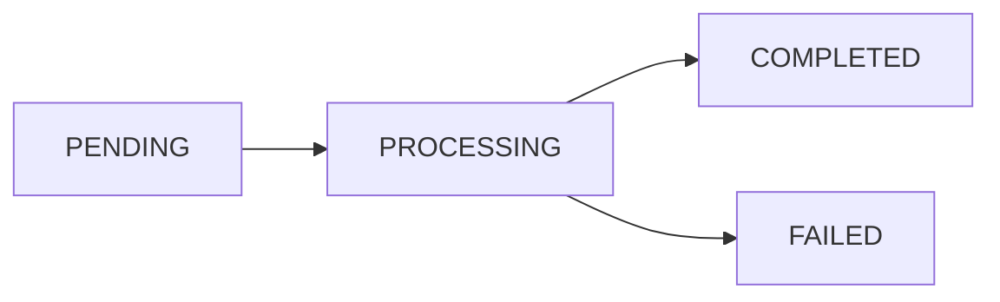

## Overview

GeoRecalcJob endpoints recalculate surface area (`totalAreaHa`) and centroid coordinates for ForestPatrimonyLevel4 units based on their active geometry in `forest_geometry_n4`. This is used when:
- Geometry was imported but surface wasn't synced to Level 4
- Manual geometry edits were made directly in PostGIS
- Surface totals need refreshing for land use reporting

## Recalculation Job Status

<ResponseField name="status" type="enum">
  - `PENDING` - Job queued
  - `PROCESSING` - Job executing
  - `COMPLETED` - Recalculation finished
  - `FAILED` - Job failed
</ResponseField>

## State Transitions



## POST /api/forest/geo/recalc (Create Job)

<Note>
  There is no dedicated `/api/forest/geo/recalc` endpoint. Recalculation jobs are created programmatically via `enqueueLevel4RecalcJob` function or processed by the worker.
</Note>

### Programmatic Enqueueing

From application code:

```typescript
import { enqueueLevel4RecalcJob } from '@/lib/geo-import-worker';

await enqueueLevel4RecalcJob({
  organizationId: 'org-uuid',
  level4Id: 'level4-uuid',
  createdById: 'user-uuid' // optional
});
```

## Worker Endpoint

### POST /api/forest/geo/import/worker

Execute recalculation jobs.

**Authentication:**
- Header `x-worker-secret` with value from `GEO_WORKER_SECRET` env var, OR
- Bearer token with `forest-patrimony:UPDATE` permission

### Request Body

<ParamField body="mode" type="enum" required>
  Set to `"recalc"` for recalculation processing
</ParamField>

### Response

<ResponseField name="processed" type="boolean">
  Whether a job was processed
</ResponseField>

<ResponseField name="status" type="enum">
  Final job status (COMPLETED or FAILED)
</ResponseField>

<ResponseField name="reason" type="string">
  Reason if not processed (e.g., "no_pending_recalc_jobs")
</ResponseField>

<RequestExample>
```bash cURL
curl -X POST "https://api.smyeg.com/api/forest/geo/import/worker" \
  -H "x-worker-secret: YOUR_WORKER_SECRET" \
  -H "Content-Type: application/json" \
  -d '{"mode": "recalc"}'
```
</RequestExample>

## Processing Logic

For each job:

1. **Query Active Geometry:** Find active (`is_active=TRUE`) geometry for Level 4
   ```sql
   SELECT
     superficie_ha,
     ST_Y(centroid) AS lat,
     ST_X(centroid) AS lon
   FROM forest_geometry_n4
   WHERE organization_id = $orgId
     AND level4_id = $level4Id
     AND is_active = TRUE
   ORDER BY valid_from DESC
   LIMIT 1
   ```

2. **Validate Geometry:** Fail job if no active geometry found

3. **Update Level 4:** Set `totalAreaHa`, `centroidLatitude`, `centroidLongitude`
   ```typescript
   await prisma.forestPatrimonyLevel4.update({
     where: { id: level4Id },
     data: {
       totalAreaHa: metric.superficie_ha,
       centroidLatitude: metric.lat,
       centroidLongitude: metric.lon
     }
   });
   ```

4. **Sync Land Use Totals:** Recalculate organization-wide `LandUseType.surfaceHa`
   - Resets all land use surfaces to 0
   - Sums `totalAreaHa` grouped by `currentLandUseName` (case-insensitive)
   - Updates matching `LandUseType` records

5. **Mark Job Complete:** Set status to `COMPLETED`, `completedAt` timestamp

## Error Handling

### No Active Geometry

If no active geometry is found:
- Job status: `FAILED`
- Error message: "No existe geometría activa para recalcular superficie"

### Query/Update Failures

- Job status: `FAILED`
- Error message: Exception message from database
- Job can be retried by creating a new recalc job

## Job Retry Logic

<ParamField body="attempts" type="integer">
  Attempt counter (incremented on each processing)
</ParamField>

<ParamField body="runAfter" type="datetime">
  Scheduled execution time (jobs with `runAfter <= NOW()` are eligible)
</ParamField>

<Note>
  There is no automatic retry. Failed jobs must be manually re-enqueued or a new job created.
</Note>

## Land Use Surface Sync

The recalculation worker calls `syncLandUseSurfaceTotals` which:

1. **Reset Surfaces:**
   ```sql
   UPDATE "LandUseType"
   SET "surfaceHa" = 0
   WHERE "organizationId" = $orgId
   ```

2. **Aggregate by Land Use:**
   ```sql
   WITH totals AS (
     SELECT
       LOWER(BTRIM(l4."currentLandUseName")) AS land_use_name,
       SUM(COALESCE(l4."totalAreaHa", 0))::numeric(14,4) AS total_surface_ha
     FROM "ForestPatrimonyLevel4" l4
     INNER JOIN "ForestPatrimonyLevel3" l3 ON l3.id = l4."level3Id"
     INNER JOIN "ForestPatrimonyLevel2" l2 ON l2.id = l3."level2Id"
     WHERE l2."organizationId" = $orgId
       AND l4."isActive" = TRUE
       AND l4."currentLandUseName" IS NOT NULL
       AND BTRIM(l4."currentLandUseName") <> ''
     GROUP BY LOWER(BTRIM(l4."currentLandUseName"))
   )
   UPDATE "LandUseType" lut
   SET "surfaceHa" = totals.total_surface_ha
   FROM totals
   WHERE lut."organizationId" = $orgId
     AND LOWER(BTRIM(lut."name")) = totals.land_use_name
   ```

<Info>
  This sync ensures land use surface totals reflect the current state of all active Level 4 units.
</Info>

## Permissions

- **UPDATE** - Execute worker (permission: `forest-patrimony:UPDATE`)
- **Worker Secret** - Bypass auth with `GEO_WORKER_SECRET` header

## Database Schema

### ForestGeometryRecalcJob

Source: `/home/daytona/workspace/source/prisma/schema.prisma:903-921`

```prisma
model ForestGeometryRecalcJob {
  id             String              @id @default(uuid()) @db.Uuid
  organizationId String              @map("organization_id") @db.Uuid
  level4Id       String              @map("level4_id") @db.Uuid
  status         GeoRecalcJobStatus  @default(PENDING)
  attempts       Int                 @default(0)
  runAfter       DateTime            @default(now()) @map("run_after")
  lastError      String?             @map("last_error")
  startedAt      DateTime?           @map("started_at")
  completedAt    DateTime?           @map("completed_at")
  createdById    String?             @map("created_by_id") @db.Uuid
  createdAt      DateTime            @default(now())
  updatedAt      DateTime            @updatedAt
  level4         ForestPatrimonyLevel4 @relation(fields: [level4Id], references: [id], onDelete: Cascade)
}
```

## Scheduling

Recommended cron schedule for recalc worker:

```bash
# Every 10 minutes
*/10 * * * * curl -X POST https://api.smyeg.com/api/forest/geo/import/worker \
  -H "x-worker-secret: $GEO_WORKER_SECRET" \
  -H "Content-Type: application/json" \
  -d '{"mode": "recalc"}'
```

## Use Cases

### After Manual Geometry Edit

If geometry is edited directly in PostGIS:

```typescript
// 1. Update geometry in forest_geometry_n4
await prisma.$executeRaw`
  UPDATE forest_geometry_n4
  SET geom = ST_SetSRID(ST_GeomFromGeoJSON(${geoJSON}), 4326),
      updated_at = NOW()
  WHERE level4_id = ${level4Id}
    AND is_active = TRUE
`;

// 2. Enqueue recalculation
await enqueueLevel4RecalcJob({
  organizationId,
  level4Id,
  createdById
});
```

### After Import Job

GeoImportJob automatically recalculates surface during import. Manual recalc is only needed if import skipped surface update.

## Related Endpoints

- [GeoImportJob](/api/geo/import-jobs) - Import shapefiles (includes automatic recalculation)
- Land Patrimonial Variations - View land use changes
