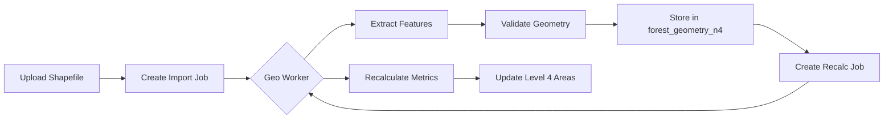
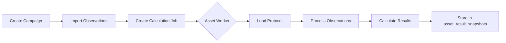

## Overview

SMyEG uses dedicated background worker processes to handle computationally intensive and asynchronous operations:

1. **Geo Worker** - Processes geospatial import, recalculation, and variation jobs
2. **Asset Measurement Worker** - Processes biological, hydrological, dendrometric, and demographic measurements

Both workers use a polling-based scheduler that continuously checks for pending jobs and processes them in batches.

## Geo Worker

The geo worker handles three types of jobs:

- **Import Jobs** - Extract and validate geospatial data from uploaded shapefiles
- **Recalc Jobs** - Recalculate areas, centroids, and metrics for Level 4 patrimony units
- **Variation Jobs** - Process split and merge operations for land patrimonial variations

### Starting the Geo Worker

```bash
# Continuous mode (runs indefinitely)
pnpm worker:geo

# Run once and exit (useful for testing)
pnpm worker:geo:once
```

### Configuration

Configure via environment variables (see [Environment Variables](/configuration/environment-variables)):

| Variable | Default | Description |
|----------|---------|-------------|
| `GEO_WORKER_INTERVAL_MS` | `4000` | Polling interval in milliseconds |
| `GEO_IMPORT_BATCH_SIZE` | `5` | Max import jobs per cycle |
| `GEO_RECALC_BATCH_SIZE` | `10` | Max recalc jobs per cycle |
| `GEO_VARIATION_BATCH_SIZE` | `15` | Max variation jobs per cycle |
| `GEO_WORKER_RUN_ONCE` | `false` | Run one cycle and exit |
| `GEO_WORKER_SECRET` | (required) | API authentication secret |

### Processing Order

Each worker cycle processes jobs in this order:

1. **Import jobs** (up to `GEO_IMPORT_BATCH_SIZE`)
2. **Recalc jobs** (up to `GEO_RECALC_BATCH_SIZE`)
3. **Variation jobs** (up to `GEO_VARIATION_BATCH_SIZE`)

### Example Output

```log
[2026-03-13T10:15:30.123Z] [geo-worker] started (interval=4000ms, importBatch=5, recalcBatch=10, variationBatch=15, runOnce=false)
[2026-03-13T10:15:34.456Z] [geo-worker] processed import_jobs=3 recalc_jobs=7 variation_jobs=0
[2026-03-13T10:15:38.789Z] [geo-worker] processed import_jobs=2 recalc_jobs=10 variation_jobs=5
```

### Architecture



### Source Code Reference

Implementation: `src/workers/geo-worker-scheduler.ts`

```typescript
// Main processing loop
const intervalMs = Number.parseInt(process.env.GEO_WORKER_INTERVAL_MS ?? "4000", 10);
const importBatchSize = Number.parseInt(process.env.GEO_IMPORT_BATCH_SIZE ?? "5", 10);
const recalcBatchSize = Number.parseInt(process.env.GEO_RECALC_BATCH_SIZE ?? "10", 10);
const variationBatchSize = Number.parseInt(process.env.GEO_VARIATION_BATCH_SIZE ?? "15", 10);

async function runBatch() {
  // Process import jobs
  for (let i = 0; i < importBatchSize; i++) {
    await processNextPendingImportJob();
  }
  
  // Process recalc jobs
  for (let i = 0; i < recalcBatchSize; i++) {
    await processNextRecalcJob();
  }
  
  // Process variation jobs
  for (let i = 0; i < variationBatchSize; i++) {
    await processNextGeoVariationJob();
  }
}
```

## Asset Measurement Worker

The asset measurement worker processes calculation jobs for biological, hydrological, dendrometric, and demographic measurement campaigns.

### Starting the Asset Worker

```bash
# Continuous mode (runs indefinitely)
pnpm worker:assets

# Run once and exit (useful for testing)
pnpm worker:assets:once
```

### Configuration

| Variable | Default | Description |
|----------|---------|-------------|
| `ASSET_MEASUREMENT_WORKER_INTERVAL_MS` | `4000` | Polling interval in milliseconds |
| `ASSET_MEASUREMENT_WORKER_BATCH_SIZE` | `20` | Max calculation jobs per cycle |
| `ASSET_MEASUREMENT_WORKER_RUN_ONCE` | `false` | Run one cycle and exit |
| `ASSET_MEASUREMENT_WORKER_SECRET` | (required) | API authentication secret |

### Measurement Domains

The worker handles four asset domains:

| Domain | Protocol Types | Purpose |
|--------|----------------|----------|
| **BIOLOGICO** | BIO_SOBREVIVENCIA, BIO_PREOPERATIVO, BIO_PRECOSECHA, BIO_CONTINUO, BIO_PARCELAS_PERMANENTES | Survival rates, pre-operative assessments, harvest readiness |
| **HIDROLOGICO** | HIDRO_ESTACION_METEOROLOGICA, HIDRO_ESTACION_HIDROLOGICA | Weather stations, hydrological monitoring |
| **DENDROMETRICO** | DENDRO_PARCELA_MULTIPROPOSITO, DENDRO_PARCELA_CARBONO | Tree measurements, carbon stock calculations |
| **DEMOGRAFICO** | DEMO_ENCUESTA_COMUNIDAD, DEMO_ENCUESTA_NUCLEO_FAMILIAR | Community surveys, household data |

### Example Output

```log
[2026-03-13T10:20:00.123Z] [asset-worker] started (interval=4000ms, batch=20, runOnce=false)
[2026-03-13T10:20:04.456Z] [asset-worker] processed calculation_jobs=15
[2026-03-13T10:20:08.789Z] [asset-worker] processed calculation_jobs=20
```

### Architecture



### Source Code Reference

Implementation: `src/workers/asset-measurement-worker-scheduler.ts`

```typescript
const intervalMs = Number.parseInt(process.env.ASSET_MEASUREMENT_WORKER_INTERVAL_MS ?? "4000", 10);
const batchSize = Number.parseInt(process.env.ASSET_MEASUREMENT_WORKER_BATCH_SIZE ?? "20", 10);

async function runBatch() {
  let processed = 0;
  
  for (let i = 0; i < batchSize; i++) {
    const result = await processNextAssetCalculationJob();
    if (!result.processed) break;
    processed++;
  }
  
  if (processed > 0) {
    console.info(`[asset-worker] processed calculation_jobs=${processed}`);
  }
}
```

## Running Workers in Production

### Using PM2 (Recommended)

PM2 provides process management, auto-restart, and monitoring.

#### Install PM2

```bash
npm install -g pm2
```

#### Configuration

Create `ecosystem.config.cjs` in project root:

```javascript ecosystem.config.cjs
module.exports = {
  apps: [
    {
      name: 'smyeg-web',
      script: 'npm',
      args: 'start',
      env: {
        NODE_ENV: 'production',
        PORT: 3000
      }
    },
    {
      name: 'smyeg-geo-worker',
      script: 'node_modules/.bin/tsx',
      args: 'src/workers/geo-worker-scheduler.ts',
      env: {
        NODE_ENV: 'production',
        GEO_WORKER_INTERVAL_MS: '4000',
        GEO_IMPORT_BATCH_SIZE: '5',
        GEO_RECALC_BATCH_SIZE: '10',
        GEO_VARIATION_BATCH_SIZE: '15'
      },
      instances: 1,
      autorestart: true,
      watch: false,
      max_memory_restart: '1G'
    },
    {
      name: 'smyeg-asset-worker',
      script: 'node_modules/.bin/tsx',
      args: 'src/workers/asset-measurement-worker-scheduler.ts',
      env: {
        NODE_ENV: 'production',
        ASSET_MEASUREMENT_WORKER_INTERVAL_MS: '4000',
        ASSET_MEASUREMENT_WORKER_BATCH_SIZE: '20'
      },
      instances: 1,
      autorestart: true,
      watch: false,
      max_memory_restart: '1G'
    }
  ]
};
```

#### Start All Services

```bash
# Build the application
pnpm build

# Start all processes
pm2 start ecosystem.config.cjs

# View status
pm2 status

# View logs
pm2 logs smyeg-geo-worker
pm2 logs smyeg-asset-worker

# Monitor
pm2 monit

# Save configuration
pm2 save

# Setup startup script
pm2 startup
```

### Using Docker

Create a dedicated service for each worker:

```yaml docker-compose.yml
services:
  web:
    build: .
    command: npm start
    environment:
      - DATABASE_URL=${DATABASE_URL}
      - NEXTAUTH_SECRET=${NEXTAUTH_SECRET}
    ports:
      - "3000:3000"
    depends_on:
      - postgres
  
  geo-worker:
    build: .
    command: pnpm worker:geo
    environment:
      - DATABASE_URL=${DATABASE_URL}
      - GEO_WORKER_INTERVAL_MS=4000
      - GEO_IMPORT_BATCH_SIZE=5
      - GEO_RECALC_BATCH_SIZE=10
      - GEO_VARIATION_BATCH_SIZE=15
      - GEO_WORKER_SECRET=${GEO_WORKER_SECRET}
    depends_on:
      - postgres
    restart: unless-stopped
  
  asset-worker:
    build: .
    command: pnpm worker:assets
    environment:
      - DATABASE_URL=${DATABASE_URL}
      - ASSET_MEASUREMENT_WORKER_INTERVAL_MS=4000
      - ASSET_MEASUREMENT_WORKER_BATCH_SIZE=20
      - ASSET_MEASUREMENT_WORKER_SECRET=${ASSET_MEASUREMENT_WORKER_SECRET}
    depends_on:
      - postgres
    restart: unless-stopped
  
  postgres:
    image: postgres:15-alpine
    environment:
      POSTGRES_USER: postgres
      POSTGRES_PASSWORD: postgres
      POSTGRES_DB: app_dev
    volumes:
      - pgdata:/var/lib/postgresql/data
```

### Using systemd (Linux)

Create service files for each worker:

```ini /etc/systemd/system/smyeg-geo-worker.service
[Unit]
Description=SMyEG Geo Worker
After=network.target postgresql.service

[Service]
Type=simple
User=smyeg
WorkingDirectory=/opt/smyeg
Environment="NODE_ENV=production"
EnvironmentFile=/opt/smyeg/.env
ExecStart=/usr/bin/node /opt/smyeg/node_modules/.bin/tsx src/workers/geo-worker-scheduler.ts
Restart=always
RestartSec=10

[Install]
WantedBy=multi-user.target
```

```bash
# Enable and start
sudo systemctl enable smyeg-geo-worker
sudo systemctl start smyeg-geo-worker

# Check status
sudo systemctl status smyeg-geo-worker

# View logs
sudo journalctl -u smyeg-geo-worker -f
```

## Monitoring and Troubleshooting

### Health Checks

Monitor worker health by checking:

1. **Process status** - Is the worker running?
2. **Database connection** - Can it connect to PostgreSQL?
3. **Job queue depth** - Are jobs piling up?
4. **Processing rate** - Are jobs being processed?

```sql
-- Check pending geo jobs
SELECT 
  status,
  COUNT(*) as count
FROM geo_import_jobs
GROUP BY status;

-- Check pending asset calculation jobs
SELECT 
  status,
  domain,
  COUNT(*) as count
FROM asset_calculation_jobs
GROUP BY status, domain;

-- Check for stuck jobs (processing > 1 hour)
SELECT *
FROM geo_import_jobs
WHERE status = 'PROCESSING'
  AND started_at < NOW() - INTERVAL '1 hour';
```

### Common Issues

#### Worker Not Processing Jobs

1. Check worker is running: `pm2 status` or `systemctl status smyeg-geo-worker`
2. Check database connection in logs
3. Verify `DATABASE_URL` environment variable
4. Check for database locks or long-running queries

#### High Memory Usage

- Reduce batch sizes
- Process jobs more frequently (decrease interval)
- Check for memory leaks in worker code
- Restart workers periodically

#### Slow Processing

- Increase batch sizes
- Scale horizontally (run multiple worker instances)
- Optimize database queries
- Add database indexes
- Consider upgrading hardware

### Graceful Shutdown

Workers handle SIGINT and SIGTERM signals for graceful shutdown:

```typescript
process.on('SIGINT', async () => {
  console.info('[geo-worker] stopping scheduler (SIGINT)...');
  await prisma.$disconnect();
  process.exit(0);
});

process.on('SIGTERM', async () => {
  console.info('[geo-worker] stopping scheduler (SIGTERM)...');
  await prisma.$disconnect();
  process.exit(0);
});
```

## Scaling Strategies

### Horizontal Scaling

Run multiple worker instances to increase throughput:

```bash
# PM2 cluster mode
pm2 start ecosystem.config.cjs --only smyeg-geo-worker -i 2
```

<Warning>
  Ensure your job queue handles concurrent processing correctly to avoid race conditions.
</Warning>

### Vertical Scaling

Increase batch sizes for more powerful hardware:

```bash
# High-performance configuration
GEO_IMPORT_BATCH_SIZE=20
GEO_RECALC_BATCH_SIZE=50
GEO_VARIATION_BATCH_SIZE=30
ASSET_MEASUREMENT_WORKER_BATCH_SIZE=100
```

### Separate Workers by Job Type

Run dedicated workers for each job type:

```javascript
// Geo import worker only
module.exports = {
  apps: [
    {
      name: 'geo-import-worker',
      script: 'tsx',
      args: 'src/workers/geo-import-only-worker.ts',
      env: { GEO_RECALC_BATCH_SIZE: '0', GEO_VARIATION_BATCH_SIZE: '0' }
    },
    {
      name: 'geo-recalc-worker',
      script: 'tsx',
      args: 'src/workers/geo-recalc-only-worker.ts',
      env: { GEO_IMPORT_BATCH_SIZE: '0', GEO_VARIATION_BATCH_SIZE: '0' }
    }
  ]
};
```

## Related Documentation

- [Environment Variables](/configuration/environment-variables) - Worker configuration options
- [Database Setup](/configuration/database-setup) - PostgreSQL configuration for workers
