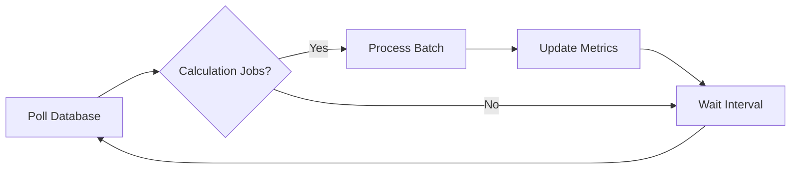

## Overview

The asset measurement worker (`asset-measurement-worker-scheduler.ts`) is a background process that handles asynchronous asset calculation jobs:

- **Asset measurements**: Computing metrics for geospatial assets (area, perimeter, volume)
- **Aggregations**: Summing measurements across hierarchical levels
- **Temporal tracking**: Recording measurement history over time

<Info>
  This worker is similar to the geo worker but focuses on asset-specific calculations rather than geometry processing.
</Info>

## Architecture

The worker polls the database for pending calculation jobs:



Each cycle:
1. Queries for jobs with status `pending`
2. Processes up to `ASSET_MEASUREMENT_WORKER_BATCH_SIZE` jobs
3. Updates asset records with calculated measurements
4. Waits for the configured interval before next poll

## Configuration

### Environment Variables

<ParamField path="ASSET_MEASUREMENT_WORKER_INTERVAL_MS" type="integer" default="4000">
  Polling interval in milliseconds. Determines how frequently the worker checks for new jobs.
  
  **Recommended range**: `3000-10000` (3-10 seconds)
</ParamField>

<ParamField path="ASSET_MEASUREMENT_WORKER_BATCH_SIZE" type="integer" default="20">
  Maximum calculation jobs processed per cycle. Asset calculations are typically faster than geometry imports.
  
  **Production recommendation**: `200` for high-throughput systems
</ParamField>

<ParamField path="ASSET_MEASUREMENT_WORKER_RUN_ONCE" type="boolean" default="false">
  If `true`, processes one batch and exits. Useful for testing and manual job processing.
</ParamField>

### Example Configurations

<CodeGroup>
```bash Development (.env)
ASSET_MEASUREMENT_WORKER_INTERVAL_MS=4000
ASSET_MEASUREMENT_WORKER_BATCH_SIZE=20
```

```bash Production (.env)
ASSET_MEASUREMENT_WORKER_INTERVAL_MS=5000
ASSET_MEASUREMENT_WORKER_BATCH_SIZE=200
```

```javascript PM2 (ecosystem.config.cjs)
{
  name: "confor-asset-worker",
  cwd: ".",
  script: "cmd",
  args: "/c pnpm worker:assets",
  env: {
    NODE_ENV: "production",
    ASSET_MEASUREMENT_WORKER_INTERVAL_MS: "5000",
    ASSET_MEASUREMENT_WORKER_BATCH_SIZE: "200",
  },
  autorestart: true,
  max_restarts: 20,
  restart_delay: 3000,
}
```
</CodeGroup>

## Running the Worker

### Development Mode

Start with hot reloading:

```bash
pnpm worker:assets
```

### Production Mode

Direct execution:

```bash
NODE_ENV=production pnpm worker:assets
```

With PM2:

```bash
# Start only asset worker
pm2 start ecosystem.config.cjs --only confor-asset-worker

# Or start all workers
pm2 start ecosystem.config.cjs
```

### Single Cycle Execution

Process one batch and exit:

```bash
pnpm worker:assets:once
```

Useful for:
- Testing configuration
- Manual job queue processing
- Scheduled maintenance tasks

## Monitoring

### Log Output

The worker logs when jobs are processed:

```
[2026-03-13T14:45:12.567Z] [asset-worker] started (interval=5000ms, batch=200, runOnce=false)
[2026-03-13T14:45:17.890Z] [asset-worker] processed calculation_jobs=45
[2026-03-13T14:45:23.123Z] [asset-worker] processed calculation_jobs=32
```

**Key observations**:
- First line confirms worker started with configuration
- Subsequent lines show jobs processed per cycle
- No output during idle cycles (normal when queue is empty)

### Error Handling

Errors are logged with stack traces:

```
[2026-03-13T14:50:33.456Z] [asset-worker] batch error Error: Database connection lost
    at processNextAssetCalculationJob (asset-measurement-worker.ts:27)
    at runBatch (asset-measurement-worker-scheduler.ts:26)
    ...
```

<Warning>
  Check error logs immediately if the worker shows `errored` status in PM2.
</Warning>

### PM2 Integration

Monitor via PM2 commands:

<CodeGroup>
```bash View Logs
pm2 logs confor-asset-worker
```

```bash Check Status
pm2 status confor-asset-worker
```

```bash Real-Time Monitor
pm2 monit
```

```bash Restart Worker
pm2 restart confor-asset-worker
```
</CodeGroup>

## Performance Optimization

### High-Throughput Scenarios

When processing large volumes of asset calculations:

```bash
ASSET_MEASUREMENT_WORKER_INTERVAL_MS=3000
ASSET_MEASUREMENT_WORKER_BATCH_SIZE=500
```

**Considerations**:
- Monitor database CPU usage
- Ensure adequate connection pool size in Prisma
- Watch for query timeouts on complex calculations

### Resource-Constrained Environments

For limited CPU or database capacity:

```bash
ASSET_MEASUREMENT_WORKER_INTERVAL_MS=10000
ASSET_MEASUREMENT_WORKER_BATCH_SIZE=10
```

### Scaling Strategies

#### Vertical Scaling

Increase batch size on powerful servers:

```bash
ASSET_MEASUREMENT_WORKER_BATCH_SIZE=1000
```

#### Horizontal Scaling

Run multiple worker instances:

```bash
pm2 start ecosystem.config.cjs --only confor-asset-worker -i 4
```

<Info>
  Ensure job processing logic uses database row locking (`SELECT ... FOR UPDATE SKIP LOCKED`) to prevent duplicate processing across instances.
</Info>

## Job Types

The worker processes different calculation types:

### Area Calculations

Computes surface area of polygons using PostGIS:

```sql
SELECT ST_Area(geometry::geography) / 10000 as hectares
FROM assets
WHERE id = $1;
```

### Perimeter Measurements

Calculates boundary length:

```sql
SELECT ST_Perimeter(geometry::geography) as meters
FROM assets;
```

### Aggregations

Sums child asset measurements to parent levels:

```sql
UPDATE nivel3_areas
SET total_hectares = (
  SELECT SUM(hectares)
  FROM nivel4_areas
  WHERE nivel3_id = nivel3_areas.id
);
```

## Troubleshooting

### Worker Not Processing Jobs

<Steps>
  <Step title="Verify Worker Status">
    ```bash
    pm2 status confor-asset-worker
    ```
    
    Status should be "online" with increasing uptime.
  </Step>
  
  <Step title="Check Logs for Errors">
    ```bash
    pm2 logs confor-asset-worker --err --lines 50
    ```
  </Step>
  
  <Step title="Confirm Database Connection">
    Verify `DATABASE_URL` in `.env` and test connection:
    
    ```bash
    psql $DATABASE_URL -c "SELECT COUNT(*) FROM asset_calculation_jobs WHERE status = 'pending';"
    ```
  </Step>
  
  <Step title="Inspect Job Queue">
    Check for pending jobs:
    
    ```sql
    SELECT status, COUNT(*), MIN(created_at) as oldest
    FROM asset_calculation_jobs
    GROUP BY status;
    ```
  </Step>
</Steps>

### Slow Processing

**Symptoms**: Large backlog of pending jobs, slow throughput

**Solutions**:

1. **Increase batch size**:
   ```bash
   ASSET_MEASUREMENT_WORKER_BATCH_SIZE=500
   ```

2. **Add database indexes**:
   ```sql
   CREATE INDEX idx_calculation_jobs_status ON asset_calculation_jobs(status, created_at);
   ```

3. **Optimize calculation queries**:
   - Use spatial indexes on geometry columns
   - Simplify complex PostGIS operations
   - Cache intermediate results

4. **Scale horizontally**:
   ```bash
   pm2 scale confor-asset-worker 3
   ```

### Memory Growth

**Cause**: Unbounded result sets or connection leaks

**Solutions**:

1. **Set PM2 memory limit**:
   ```javascript
   {
     name: "confor-asset-worker",
     max_memory_restart: "512M",
   }
   ```

2. **Review Prisma connection handling**:
   Ensure `prisma.$disconnect()` is called on shutdown

3. **Limit query result sizes**:
   Use pagination for large datasets

### Jobs Stuck in "processing"

**Cause**: Worker crashed during job execution

**Solution**: Reset stale jobs:

```sql
UPDATE asset_calculation_jobs
SET status = 'pending',
    updated_at = NOW()
WHERE status = 'processing'
  AND updated_at < NOW() - INTERVAL '30 minutes';
```

Then restart the worker:

```bash
pm2 restart confor-asset-worker
```

## Graceful Shutdown

The worker handles termination signals gracefully:

```typescript
process.on('SIGTERM', () => {
  clearInterval(timer);
  void shutdown('SIGTERM');
});
```

**Shutdown sequence**:
1. Stop polling for new jobs
2. Complete current batch
3. Close database connections via `prisma.$disconnect()`
4. Exit with code 0

PM2 sends `SIGTERM` on:
- `pm2 stop confor-asset-worker`
- `pm2 restart confor-asset-worker`
- System shutdown (if configured with `pm2 startup`)

## Integration with Geo Worker

Asset calculations often depend on geometry data processed by the geo worker:


**Best practice**: Ensure both workers are running for complete data pipeline:

```bash
pm2 start ecosystem.config.cjs  # Starts both workers
```

## Next Steps

<CardGroup cols={2}>
  <Card title="Monitoring Setup" icon="chart-line" href="/deployment/monitoring">
    Configure comprehensive monitoring and alerts
  </Card>
  <Card title="Troubleshooting Guide" icon="wrench" href="/deployment/troubleshooting">
    Review common issues and solutions
  </Card>
</CardGroup>