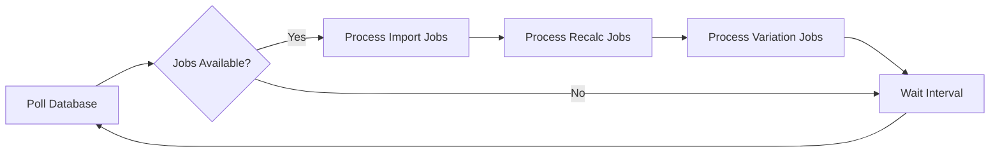

## Overview

The geo worker scheduler (`geo-worker-scheduler.ts`) is a dedicated background process that handles asynchronous geospatial operations:

- **Shapefile imports**: Processing uploaded ZIP files containing shapefiles
- **Geometry recalculations**: Updating area calculations when boundaries change
- **Variation analysis**: Computing temporal changes in geospatial data

<Info>
  The worker uses a polling architecture, querying the database for pending jobs at regular intervals.
</Info>

## How It Works

The worker runs in a continuous loop:



Each cycle processes:
1. Up to `GEO_IMPORT_BATCH_SIZE` import jobs
2. Up to `GEO_RECALC_BATCH_SIZE` recalculation jobs
3. Up to `GEO_VARIATION_BATCH_SIZE` variation jobs

## Configuration

### Environment Variables

<ParamField path="GEO_WORKER_INTERVAL_MS" type="integer" default="4000">
  Polling interval in milliseconds. Lower values increase responsiveness but add database load.
  
  **Production recommendation**: `5000` (5 seconds)
</ParamField>

<ParamField path="GEO_IMPORT_BATCH_SIZE" type="integer" default="5">
  Maximum shapefile import jobs processed per cycle. Import jobs are CPU and I/O intensive.
  
  **Production recommendation**: `500` for high-throughput systems, `5-10` for resource-constrained environments
</ParamField>

<ParamField path="GEO_RECALC_BATCH_SIZE" type="integer" default="10">
  Maximum geometry recalculation jobs per cycle. These are database-heavy operations.
  
  **Production recommendation**: `200` with adequate PostgreSQL resources
</ParamField>

<ParamField path="GEO_VARIATION_BATCH_SIZE" type="integer" default="15">
  Maximum variation analysis jobs per cycle. These compute temporal diffs between geometries.
  
  **Production recommendation**: `150` for real-time variation tracking
</ParamField>

<ParamField path="GEO_WORKER_RUN_ONCE" type="boolean" default="false">
  If `true`, the worker executes one cycle and exits. Useful for manual runs and testing.
</ParamField>

### Example Configuration

<CodeGroup>
```bash Development (.env)
GEO_WORKER_INTERVAL_MS=4000
GEO_IMPORT_BATCH_SIZE=5
GEO_RECALC_BATCH_SIZE=10
GEO_VARIATION_BATCH_SIZE=15
```

```bash Production (.env)
GEO_WORKER_INTERVAL_MS=5000
GEO_IMPORT_BATCH_SIZE=500
GEO_RECALC_BATCH_SIZE=200
GEO_VARIATION_BATCH_SIZE=150
```

```javascript PM2 (ecosystem.config.cjs)
{
  name: "confor-geo-worker",
  script: "cmd",
  args: "/c pnpm worker:geo",
  env: {
    NODE_ENV: "production",
    GEO_WORKER_INTERVAL_MS: "5000",
    GEO_IMPORT_BATCH_SIZE: "500",
    GEO_RECALC_BATCH_SIZE: "200",
    GEO_VARIATION_BATCH_SIZE: "150",
  },
}
```
</CodeGroup>

## Running the Worker

### Development Mode

Start the worker with hot reloading:

```bash
pnpm worker:geo
```

### Production Mode

Run directly:

```bash
NODE_ENV=production pnpm worker:geo
```

Or use PM2 (recommended):

```bash
pm2 start ecosystem.config.cjs --only confor-geo-worker
```

### Single Cycle Execution

For testing or manual job processing:

```bash
pnpm worker:geo:once
```

This runs one cycle and exits, useful for:
- Testing configuration changes
- Manual job queue draining
- Scheduled cron jobs

## Monitoring

### Log Output

The worker logs every cycle where jobs are processed:

```
[2026-03-13T14:32:10.123Z] [geo-worker] started (interval=5000ms, importBatch=500, recalcBatch=200, variationBatch=150, runOnce=false)
[2026-03-13T14:32:15.456Z] [geo-worker] processed import_jobs=3 recalc_jobs=12 variation_jobs=5
[2026-03-13T14:32:20.789Z] [geo-worker] processed import_jobs=2 recalc_jobs=8 variation_jobs=0
```

<Tip>
  No output during idle cycles means no pending jobs, which is normal behavior.
</Tip>

### Error Logs

Errors are logged with full stack traces:

```
[2026-03-13T14:35:22.345Z] [geo-worker] batch error Error: Connection refused
    at processNextImportJob (geo-import-worker.ts:45)
    ...
```

### PM2 Monitoring

When running under PM2:

```bash
# Real-time logs
pm2 logs confor-geo-worker

# Process status
pm2 status confor-geo-worker

# CPU and memory usage
pm2 monit
```

## Performance Tuning

### High-Volume Import Scenarios

When processing large batches of shapefiles:

```bash
GEO_WORKER_INTERVAL_MS=3000       # Faster polling
GEO_IMPORT_BATCH_SIZE=1000        # Process more per cycle
GEO_RECALC_BATCH_SIZE=500
GEO_VARIATION_BATCH_SIZE=300
```

<Warning>
  High batch sizes increase memory usage and database load. Monitor system resources and adjust accordingly.
</Warning>

### Resource-Constrained Environments

For systems with limited CPU or database capacity:

```bash
GEO_WORKER_INTERVAL_MS=10000      # Less frequent polling
GEO_IMPORT_BATCH_SIZE=2           # Process fewer per cycle
GEO_RECALC_BATCH_SIZE=5
GEO_VARIATION_BATCH_SIZE=5
```

### Scaling Horizontally

Run multiple worker instances for parallel processing:

```bash
# Start 3 instances
pm2 start ecosystem.config.cjs --only confor-geo-worker -i 3
```

<Info>
  Job processing functions should use database locks (`SELECT ... FOR UPDATE SKIP LOCKED`) to prevent duplicate processing.
</Info>

## Troubleshooting

### Worker Not Processing Jobs

**Symptoms**:
- No log output
- Jobs remain in "pending" state
- Dashboard shows queued imports

**Diagnostic Steps**:

<Steps>
  <Step title="Check Worker Status">
    ```bash
    pm2 status confor-geo-worker
    ```
    
    Ensure status is "online" and uptime is increasing.
  </Step>
  
  <Step title="Review Logs">
    ```bash
    pm2 logs confor-geo-worker --lines 50
    ```
    
    Look for startup message and error traces.
  </Step>
  
  <Step title="Verify Database Connection">
    Check `DATABASE_URL` in `.env` is correct and database is accessible.
  </Step>
  
  <Step title="Inspect Job Queue">
    Query pending jobs directly:
    
    ```sql
    SELECT status, COUNT(*) 
    FROM shapefile_import_jobs 
    GROUP BY status;
    ```
  </Step>
</Steps>

### High CPU Usage

**Cause**: Large batch sizes or geometry-intensive operations.

**Solutions**:
- Reduce `GEO_IMPORT_BATCH_SIZE` and `GEO_RECALC_BATCH_SIZE`
- Increase `GEO_WORKER_INTERVAL_MS` to reduce polling frequency
- Optimize PostGIS queries (add spatial indexes)

### Memory Leaks

**Symptoms**: Worker memory usage grows over time and doesn't stabilize.

**Solutions**:

1. Enable PM2 memory limit:
   ```javascript
   {
     name: "confor-geo-worker",
     max_memory_restart: "1G",
   }
   ```

2. Check for unclosed database connections in worker logic

3. Review shapefile processing for large file retention

### Jobs Stuck in "processing" State

**Cause**: Worker crashed mid-job without updating status.

**Solution**: Implement job timeout logic or manually reset:

```sql
UPDATE shapefile_import_jobs 
SET status = 'pending', 
    updated_at = NOW()
WHERE status = 'processing' 
  AND updated_at < NOW() - INTERVAL '1 hour';
```

## Graceful Shutdown

The worker handles `SIGINT` and `SIGTERM` signals:

```typescript
process.on('SIGTERM', () => {
  clearInterval(timer);
  void shutdown('SIGTERM');
});
```

On shutdown:
1. Current batch completes
2. Database connections close
3. Process exits cleanly

PM2 automatically sends `SIGTERM` on `pm2 stop` or `pm2 restart`.

## Next Steps

<CardGroup cols={2}>
  <Card title="Asset Worker" icon="chart-line" href="/deployment/workers/asset-worker">
    Configure the asset measurement worker
  </Card>
  <Card title="Monitoring" icon="eye" href="/deployment/monitoring">
    Set up comprehensive monitoring
  </Card>
</CardGroup>