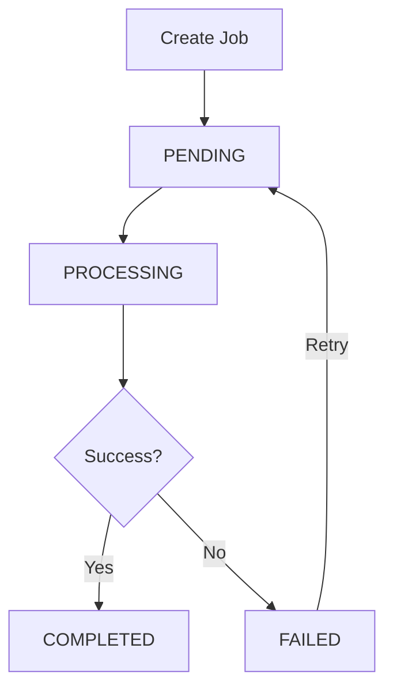

## Overview

The Land Accounting module tracks changes in land use across your patrimony, capturing the patrimonial impact of land use transitions. This supports environmental accounting, carbon tracking, and regulatory compliance.

## Patrimonial Variations

A **Land Patrimonial Variation** records:

- The Level 4 unit affected
- Previous and new land use
- Affected area in hectares
- Reference values (before and after)
- Patrimonial delta (financial impact)
- Date and status of the variation

## Variation Types (Kind)

<ResponseField name="INCREMENTO" type="kind">
  Represents an increase in patrimonial value due to land use change.
  
  **Example**: Converting "NO BOSQUE" to "BOSQUE" or "PLANTACION"
</ResponseField>

<ResponseField name="DECREMENTO" type="kind">
  Represents a decrease in patrimonial value.
  
  **Example**: Converting "BOSQUE" to "INFRAESTRUCTURA" or "CAMINO"
</ResponseField>

<ResponseField name="SIN_CAMBIO" type="kind">
  Land use changed but patrimonial impact is neutral or not yet calculated.
  
  **Example**: Reforestation within the same category
</ResponseField>

## Variation Status

<ResponseField name="PENDIENTE" type="status">
  Variation has been recorded but not yet reviewed or processed.
</ResponseField>

<ResponseField name="PROCESADA" type="status">
  Variation has been reviewed, approved, and integrated into reports.
</ResponseField>

<ResponseField name="ANULADA" type="status">
  Variation was cancelled or rejected. Data preserved for audit.
</ResponseField>

## Creating Variations

Variations are created in two ways:

### 1. Automatic (via Shapefile Import)

When you import a shapefile with land use information, the system automatically creates variations:

<Steps>
  <Step title="Import Shapefile">
    Upload a shapefile containing `currentLandUseName` and optionally `previousLandUseName` attributes.
    
    See [Shapefile Import](/guides/shapefile-import) for details.
  </Step>
  
  <Step title="System Detects Changes">
    During processing, if `currentLandUseName` differs from the existing land use in the database, a variation is created.
  </Step>
  
  <Step title="Variation Created">
    A `LandPatrimonialVariation` record is inserted with:
    - `previousLandUseName` - From database or shapefile
    - `newLandUseName` - From shapefile
    - `affectedAreaHa` - Calculated from geometry
    - `variationDate` - From shapefile or import defaults
    - `status` - Set to `PENDIENTE`
  </Step>
</Steps>

**Example Flow**:

```typescript
// Existing in database:
Level4.currentLandUseName = "NO BOSQUE"
Level4.totalAreaHa = 12.5

// Shapefile attribute:
feature.properties.currentLandUseName = "BOSQUE"

// System creates variation:
{
  previousLandUseName: "NO BOSQUE",
  newLandUseName: "BOSQUE",
  affectedAreaHa: 12.5,
  kind: "INCREMENTO",
  status: "PENDIENTE",
  variationDate: "2026-03-15"
}
```

### 2. Manual (via Bulk Operations)

Create variations for multiple Level 4 units:

<Steps>
  <Step title="Navigate to Land Variations">
    Go to **Forest Patrimony** → **Land Accounting** → **Create Variation**.
  </Step>
  
  <Step title="Select Units">
    Choose the Level 4 units affected by the land use change.
  </Step>
  
  <Step title="Enter Details">
    Provide:
    - **New Land Use** - The updated land use classification
    - **Previous Land Use** (optional) - The former land use
    - **Variation Date** - When the change occurred
    - **Notes** - Reason or context for the change
  </Step>
  
  <Step title="Submit Job">
    Click **Create Variations**. A background job processes the request and creates individual variation records.
  </Step>
</Steps>

**Example API Request**:

```json
{
  "operationType": "MERGE",
  "variationDate": "2026-03-15T00:00:00.000Z",
  "notes": "Land use update from field survey",
  "items": [
    {
      "level4Id": "level4-uuid-1",
      "previousLandUseName": "NO BOSQUE",
      "newLandUseName": "BOSQUE",
      "affectedAreaHa": 15.3
    },
    {
      "level4Id": "level4-uuid-2",
      "previousLandUseName": "AGRICULTURA",
      "newLandUseName": "PLANTACION",
      "affectedAreaHa": 8.7
    }
  ]
}
```

## Processing Variations

Variations remain in `PENDIENTE` status until reviewed:

<Steps>
  <Step title="Review Pending Variations">
    Navigate to **Land Accounting** → **Pending Variations**.
  </Step>
  
  <Step title="Verify Details">
    Check:
    - Land use change is accurate
    - Affected area is correct
    - Date is appropriate
    - Notes provide sufficient context
  </Step>
  
  <Step title="Update Values (Optional)">
    Enter financial impact:
    - `referenceValueBeforeUsd` - Estimated value before change
    - `referenceValueAfterUsd` - Estimated value after change
    - `totalValueBeforeUsd` - Total before (area × reference value)
    - `totalValueAfterUsd` - Total after (area × reference value)
    - `patrimonialDeltaUsd` - Net change (after - before)
  </Step>
  
  <Step title="Process or Reject">
    - **Process**: Set status to `PROCESADA` and record processor ID
    - **Reject**: Set status to `ANULADA` with rejection reason in notes
  </Step>
</Steps>

### Example Processing

```json
{
  "id": "variation-uuid",
  "status": "PROCESADA",
  "referenceValueBeforeUsd": 1000.00,
  "referenceValueAfterUsd": 2500.00,
  "totalValueBeforeUsd": 12500.00,
  "totalValueAfterUsd": 31250.00,
  "patrimonialDeltaUsd": 18750.00,
  "processedById": "user-uuid",
  "processedAt": "2026-03-16T10:30:00.000Z"
}
```

## Land Use Type Surface Tracking

The system maintains aggregate surface totals for each land use type:

### Automatic Synchronization

After shapefile imports, the system recalculates totals:

```sql
-- Aggregate by land use name
SELECT 
  LOWER(TRIM(currentLandUseName)) as land_use_name,
  SUM(totalAreaHa) as total_surface_ha
FROM ForestPatrimonyLevel4
WHERE organizationId = ?
  AND isActive = true
  AND currentLandUseName IS NOT NULL
GROUP BY LOWER(TRIM(currentLandUseName))

-- Update LandUseType.surfaceHa
UPDATE LandUseType
SET surfaceHa = calculated_total
WHERE organizationId = ?
  AND LOWER(TRIM(name)) = land_use_name
```

### Viewing Land Use Totals

Navigate to **Configuration** → **Land Use Types** to view:

- Land use name and category
- Total surface area (ha) across all Level 4 units
- Whether it's productive land

## Geo Variation Jobs

Bulk variation creation is handled via asynchronous jobs:

### Job Status Flow



### Job Payload Structure

```json
{
  "items": [
    {
      "level4Id": "uuid",
      "previousLandUseName": "NO BOSQUE",
      "newLandUseName": "BOSQUE",
      "affectedAreaHa": 12.5
    }
  ]
}
```

### Monitoring Jobs

Track job progress:

```bash
GET /api/forest/geo/operations?jobId={jobId}
```

Response includes:
- Job status (PENDING, PROCESSING, COMPLETED, FAILED)
- Start and completion timestamps
- Error messages (if failed)
- Number of variations created

## Reporting

### Variation Summary Report

Generate a report of all variations by:

- Date range
- Organization
- Status (PENDIENTE, PROCESADA, ANULADA)
- Land use type
- Level 2/3 patrimony unit

**Metrics Included**:
- Total affected area (ha)
- Number of variations
- Patrimonial delta sum
- Breakdown by land use transition

### Land Use Change Matrix

Visualize transitions between land use types:

|  | BOSQUE | PLANTACION | AGRICULTURA | NO BOSQUE |
|---|--------|------------|-------------|----------|
| **BOSQUE** | - | 0 ha | 0 ha | 0 ha |
| **PLANTACION** | 12.5 ha | - | 0 ha | 0 ha |
| **AGRICULTURA** | 8.7 ha | 15.3 ha | - | 0 ha |
| **NO BOSQUE** | 25.0 ha | 10.0 ha | 5.0 ha | - |

## Organization Isolation

<Warning>
  Variations are strictly isolated by organization. Users can only create and view variations for Level 4 units in their own organization.
</Warning>

- Organization ID is derived from the authenticated user
- Hierarchy validation ensures Level 4 units belong to the user's organization
- Background jobs respect organization boundaries

## Best Practices

<Card title="Document Changes" icon="file-text">
  Always include detailed notes explaining the reason for land use changes. This supports audits and compliance.
</Card>

<Card title="Process Variations Promptly" icon="clock">
  Review and process pending variations regularly to keep patrimonial accounts up to date.
</Card>

<Card title="Validate Before Import" icon="shield-check">
  When using shapefile import, verify land use values match your catalog to avoid validation errors.
</Card>

<Card title="Track Financial Impact" icon="dollar-sign">
  Enter reference values for processed variations to calculate patrimonial deltas for financial reporting.
</Card>

## Validation Rules

### Land Use Name Validation

Both `previousLandUseName` and `newLandUseName` must:

- Match an entry in `LandUseType` table (case-insensitive)
- Belong to the user's organization
- Be marked as `isActive: true`

**Error if not found**:
```
"El uso actual no existe en la tabla auxiliar de Uso de Suelos"
```

### Area Validation

- `affectedAreaHa` must be greater than 0
- Cannot exceed the Level 4 unit's `totalAreaHa`
- For partial area changes, create separate variations

### Date Validation

- `variationDate` cannot be in the future
- Should logically align with field survey or satellite imagery dates

## Permissions Required

| Action | Required Permission |
|--------|--------------------|
| View variations | `forest-patrimony:READ` |
| Create variations | `forest-patrimony:CREATE` or `forest-patrimony:UPDATE` |
| Process variations | `forest-patrimony:UPDATE` |
| Annul variations | `forest-patrimony:DELETE` or `forest-patrimony:UPDATE` |
| Export reports | `forest-patrimony:EXPORT` |

## FAQ

<Accordion title="What's the difference between automatic and manual variations?">
  Automatic variations are created during shapefile import when land use changes are detected. Manual variations are created via the bulk operations interface for planned changes.
</Accordion>

<Accordion title="Can I delete a variation?">
  Variations are typically not deleted. Instead, set status to `ANULADA` to cancel while preserving audit history.
</Accordion>

<Accordion title="How do I correct an error in a variation?">
  Annul the incorrect variation (status = ANULADA) and create a new variation with correct data.
</Accordion>

<Accordion title="Why is my variation stuck in PENDIENTE?">
  Variations remain PENDIENTE until explicitly processed. Review and update status to PROCESADA when validation is complete.
</Accordion>

<Accordion title="Can a single Level 4 unit have multiple variations?">
  Yes. You can track multiple changes over time. Each variation has a unique date and represents a distinct land use transition.
</Accordion>

## Related Pages

<CardGroup cols={2}>
  <Card title="Shapefile Import" icon="map" href="/guides/shapefile-import">
    Import geospatial data and auto-generate variations
  </Card>
  <Card title="Forest Patrimony" icon="tree" href="/features/forest-patrimony">
    Understanding the patrimony hierarchy
  </Card>
</CardGroup>