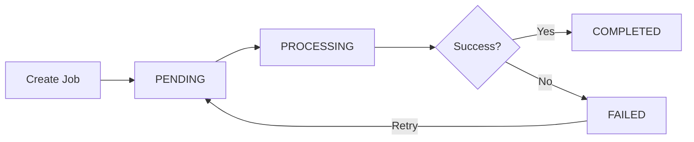

## Overview

Asset Measurement Campaigns allow you to record field observations for biological, hydrological, dendrometric, and demographic assets. Campaigns organize measurements by protocol type, location (Level 4), and date.

## Campaign Domains

Campaigns are organized into four domains:

| Domain | Code | Purpose |
|--------|------|----------|
| Biological | `BIOLOGICO` | Tree survival, growth, health monitoring |
| Hydrological | `HIDROLOGICO` | Weather stations, stream flow, rainfall |
| Dendrometric | `DENDROMETRICO` | Tree diameter, height, volume measurements |
| Demographic | `DEMOGRAFICO` | Community surveys, household data |

## Measurement Protocol Types

### Biological Protocols

- `BIO_SOBREVIVENCIA` - Survival rate monitoring
- `BIO_PREOPERATIVO` - Pre-operational assessment
- `BIO_PRECOSECHA` - Pre-harvest inventory
- `BIO_CONTINUO` - Continuous monitoring
- `BIO_PARCELAS_PERMANENTES` - Permanent plot monitoring

### Hydrological Protocols

- `HIDRO_ESTACION_METEOROLOGICA` - Meteorological station data
- `HIDRO_ESTACION_HIDROLOGICA` - Hydrological station monitoring

### Dendrometric Protocols

- `DENDRO_PARCELA_MULTIPROPOSITO` - Multi-purpose plot measurement
- `DENDRO_PARCELA_CARBONO` - Carbon plot assessment

### Demographic Protocols

- `DEMO_ENCUESTA_COMUNIDAD` - Community survey
- `DEMO_ENCUESTA_NUCLEO_FAMILIAR` - Household survey

## Campaign Statuses

<ResponseField name="DRAFT" type="status">
  Campaign is being set up. No calculations performed yet.
</ResponseField>

<ResponseField name="ACTIVE" type="status">
  Campaign is open for data collection. Observations can be added.
</ResponseField>

<ResponseField name="CLOSED" type="status">
  Campaign is complete. Results are final. No new observations allowed.
</ResponseField>

<ResponseField name="CANCELLED" type="status">
  Campaign was cancelled. Data preserved but marked as invalid.
</ResponseField>

## Creating a Campaign

<Steps>
  <Step title="Navigate to Campaigns">
    Go to **Asset Measurement** → **Campaigns** from the main menu.
  </Step>
  
  <Step title="Click New Campaign">
    Click the **Create Campaign** button.
  </Step>
  
  <Step title="Select Domain and Protocol">
    Choose the measurement domain and specific protocol type:
    - **Domain**: BIOLOGICO, HIDROLOGICO, DENDROMETRICO, or DEMOGRAFICO
    - **Protocol Type**: Specific protocol within the domain
  </Step>
  
  <Step title="Enter Campaign Details">
    Fill in the required information:
    - **Campaign Code** - Unique identifier (e.g., "BIO-2026-001")
    - **Campaign Name** - Descriptive name
    - **Level 4 Unit** - The rodal/parcel where measurements occur
    - **Campaign Date** - Date of the measurement campaign
    - **Schema Version** - Protocol version (default: "1.0")
    - **Status** - Start as DRAFT or set to ACTIVE immediately
    - **Notes** - Optional campaign notes
  </Step>
  
  <Step title="Save Campaign">
    Click **Create** to save the campaign. It will be available for data entry.
  </Step>
</Steps>

### Example API Request

```json
{
  "level4Id": "123e4567-e89b-12d3-a456-426614174000",
  "domain": "BIOLOGICO",
  "protocolType": "BIO_SOBREVIVENCIA",
  "campaignCode": "BIO-2026-SURVIVAL-001",
  "campaignName": "Survival Assessment Q1 2026",
  "campaignDate": "2026-03-15T00:00:00.000Z",
  "schemaVersion": "1.0",
  "status": "ACTIVE",
  "notes": "First survival check after planting season",
  "metadata": {
    "technician": "Juan Pérez",
    "weather": "Sunny, 28°C"
  }
}
```

## Adding Observations

Once a campaign is created, you can record observations:

<Steps>
  <Step title="Open Campaign">
    From the Campaigns list, click on the campaign to view details.
  </Step>
  
  <Step title="Add Observation">
    Click **New Observation** to record a measurement.
  </Step>
  
  <Step title="Enter Observation Data">
    Provide:
    - **Level 5 Unit Code** (optional) - Specific plot/sample unit
    - **Section Key** (optional) - Subsection identifier
    - **Observed At** - Timestamp of observation
    - **Payload** - JSON data following the protocol schema
  </Step>
  
  <Step title="Save Observation">
    Click **Save** to add the observation to the campaign.
  </Step>
</Steps>

### Example Observation

```json
{
  "campaignId": "campaign-uuid",
  "level5UnitCode": "PLOT-001",
  "sectionKey": "SECTION-A",
  "observedAt": "2026-03-15T09:30:00.000Z",
  "payload": {
    "trees_alive": 245,
    "trees_dead": 12,
    "trees_missing": 3,
    "survival_rate": 94.2,
    "notes": "Some mortality from drought stress"
  }
}
```

## Calculating Results

After collecting observations, trigger calculations:

<Steps>
  <Step title="Review Observations">
    Verify all observations are recorded correctly.
  </Step>
  
  <Step title="Trigger Calculation">
    Click **Calculate Results** on the campaign details page.
  </Step>
  
  <Step title="Monitor Calculation Job">
    A calculation job is created with status:
    - `PENDING` - Queued for processing
    - `PROCESSING` - Calculations in progress
    - `COMPLETED` - Results ready
    - `FAILED` - Error occurred (check error message)
  </Step>
  
  <Step title="View Results">
    Once completed, results are available in the **Results** tab.
  </Step>
</Steps>

### Calculation Job Lifecycle



## Result Snapshots

Calculation results are stored as **snapshots** with versioning:

<ResponseField name="resultKey" type="string">
  Unique identifier for the result type (e.g., "survival_summary", "volume_estimates")
</ResponseField>

<ResponseField name="resultVersion" type="number">
  Version number (increments with each recalculation)
</ResponseField>

<ResponseField name="resultPayload" type="json">
  The calculated results in JSON format
</ResponseField>

<ResponseField name="isCurrent" type="boolean">
  Whether this is the current (most recent) version
</ResponseField>

<ResponseField name="calculatedAt" type="datetime">
  When the calculation was performed
</ResponseField>

### Example Result Snapshot

```json
{
  "campaignId": "campaign-uuid",
  "level4Id": "level4-uuid",
  "domain": "BIOLOGICO",
  "resultKey": "survival_summary",
  "resultVersion": 2,
  "schemaVersion": "1.0",
  "resultPayload": {
    "total_planted": 260,
    "total_alive": 245,
    "total_dead": 12,
    "total_missing": 3,
    "survival_percentage": 94.2,
    "mortality_percentage": 4.6,
    "missing_percentage": 1.2,
    "calculated_at": "2026-03-15T14:30:00.000Z"
  },
  "isCurrent": true,
  "calculatedAt": "2026-03-15T14:30:00.000Z"
}
```

## Updating Campaigns

You can update campaign details at any time:

### Editable Fields

- `campaignName` - Update the display name
- `campaignDate` - Adjust the campaign date
- `status` - Change status (DRAFT → ACTIVE → CLOSED)
- `notes` - Add or modify notes
- `metadata` - Update custom metadata

### Non-Editable Fields

- `campaignCode` - Cannot be changed after creation (unique constraint)
- `domain` - Cannot be changed (affects protocol)
- `protocolType` - Cannot be changed (affects schema)
- `level4Id` - Cannot be changed (location is fixed)

<Warning>
  Changing status to CLOSED prevents adding new observations. This action cannot be easily undone.
</Warning>

## Deleting Campaigns

Campaigns can only be deleted if:

- No observations are recorded
- No result snapshots exist
- No calculation jobs are associated

If data exists, you must:
1. Delete all observations
2. Delete all results
3. Cancel/delete calculation jobs
4. Then delete the campaign

Or, alternatively, set the status to `CANCELLED` to preserve data.

## Filtering and Searching

### Available Filters

- **Level 4 Unit** - Filter by location
- **Domain** - Filter by measurement domain
- **Protocol Type** - Filter by specific protocol
- **Status** - Filter by campaign status
- **Search** - Search by campaign code or name (case-insensitive)

### Sorting Options

- Sort by campaign date (newest or oldest first)
- Sort by creation date
- Sort by campaign code (alphabetical)

## Import/Export

### Importing Observations

Bulk import observations from CSV or Excel:

```bash
POST /api/assets/measurement-observations/import
```

**Required columns**:
- `campaignCode` - Links to existing campaign
- `level5UnitCode` (optional)
- `observedAt`
- Protocol-specific data columns

### Exporting Campaigns

```bash
GET /api/assets/measurement-campaigns/export?format=xlsx
```

Exports all campaigns with:
- Campaign details
- Observation counts
- Result summaries
- Calculation job status

## Organization Isolation

<Warning>
  Campaigns are strictly isolated by organization. Users can only create, view, and manage campaigns for Level 4 units in their own organization.
</Warning>

- Organization ID is resolved from the authenticated user
- Level 4 unit must belong to the user's organization
- SUPER_ADMIN users can view cross-organization data

## Best Practices

<Card title="Use Descriptive Codes" icon="tag">
  Create campaign codes that include domain, year, and sequence number. Example: `BIO-2026-SURVIVAL-001`
</Card>

<Card title="Set Status Appropriately" icon="toggle-on">
  Keep campaigns in DRAFT while setting up. Change to ACTIVE when ready for field work. Close campaigns when data collection is complete.
</Card>

<Card title="Version Results" icon="code-branch">
  Results are versioned automatically. You can recalculate without losing historical data.
</Card>

<Card title="Add Metadata" icon="database">
  Use the `metadata` field to store additional context like technician names, weather conditions, or equipment used.
</Card>

## Permissions Required

| Action | Required Permission |
|--------|--------------------|
| View campaigns | `asset-measurement:READ` or write permissions |
| Create campaigns | `asset-measurement:CREATE` |
| Update campaigns | `asset-measurement:UPDATE` |
| Delete campaigns | `asset-measurement:DELETE` |
| Export campaigns | `asset-measurement:EXPORT` |

## FAQ

<Accordion title="Can I change the protocol type after creating a campaign?">
  No. The protocol type determines the data schema and cannot be changed. Create a new campaign if you need a different protocol.
</Accordion>

<Accordion title="What happens if I change a campaign status from ACTIVE to CLOSED?">
  Observations can no longer be added, but existing data is preserved. Results remain accessible.
</Accordion>

<Accordion title="Can I have multiple campaigns for the same Level 4 unit?">
  Yes. You can have multiple campaigns at the same location, even with the same protocol. Differentiate them using unique campaign codes and dates.
</Accordion>

<Accordion title="How do I recalculate results?">
  Create a new calculation job for the campaign. The system will generate a new result snapshot with an incremented version number.
</Accordion>

## Related Pages

<CardGroup cols={2}>
  <Card title="Forest Patrimony" icon="tree" href="/features/forest-patrimony">
    Understanding Level 4 units and hierarchy
  </Card>
  <Card title="Data Import" icon="file-import" href="/guides/shapefile-import">
    Bulk importing measurement observations
  </Card>
</CardGroup>